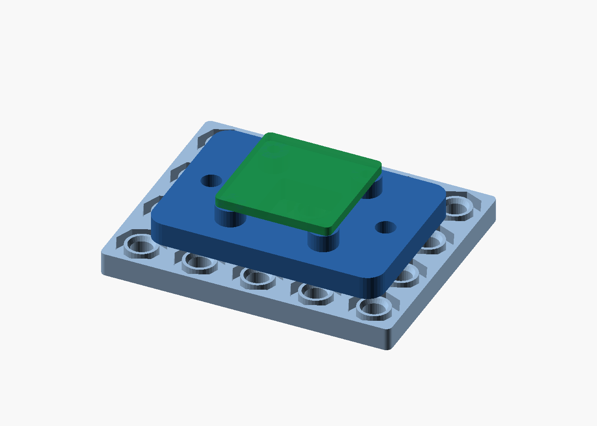
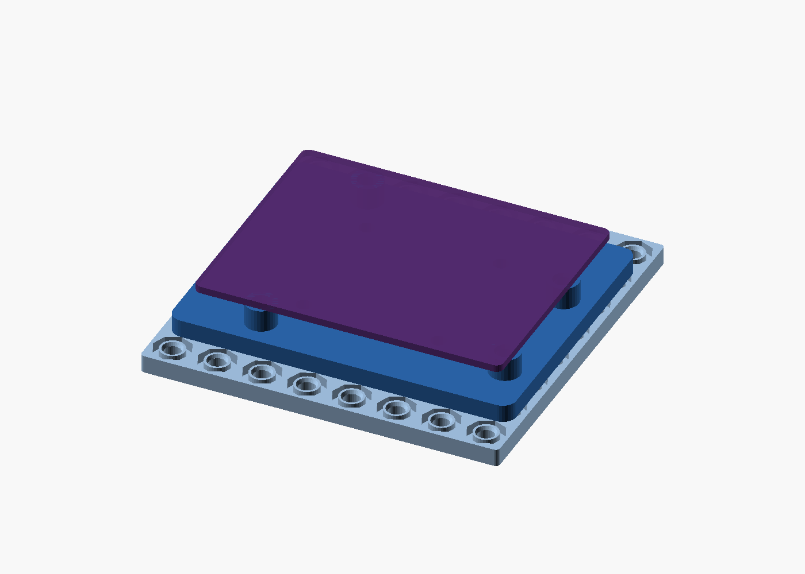
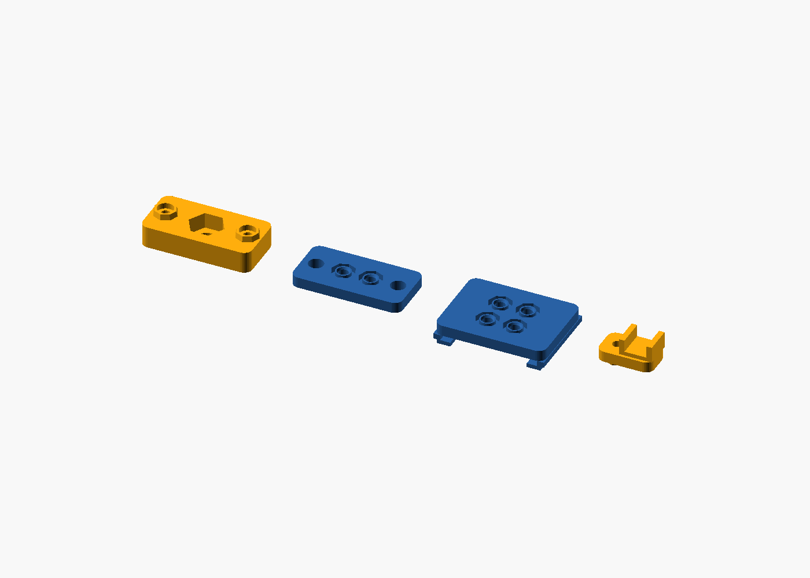

# RobotSkin

<p align="center">
  
</p>

**Print a mechanical skin for your electronics.** RobotSkin turns sensors,
microcontrollers, cameras, and mounting surfaces into one reusable building
system. Print a plate, add a carrier or adapter, and lock the result with the
same 10 mm connector grid.

It is an OpenSCAD design library with ready-to-print STL exports—made for FDM
printers, prototypes that change, and projects that should not need a new
custom enclosure every time.

> **V0.1 is engineering hardware.** Print the calibration part before a larger
> build; the interface is reusable, but it is not yet load-rated.

## One interface, many jobs

- **Structural surfaces:** 8×8 plates and smaller full-through mounting plates.
- **Structures:** flat, inner-corner, and outer-corner joins.
- **Electronics:** a Seeed 104020111 Grove 16×2 LCD carrier, a cable clip, and a solid UNO-format
  carrier.
- **Mounting adapters:** camera-tripod, 20-series extrusion, and TH35 DIN rail
  adapters, plus an H25T servo-horn plate.

<p align="center">
  
  
</p>

Every part shares the same connector: a blind octagonal port accepts a hollow
octagonal peg. Press it together for a temporary fit; for a permanent joint,
install an M3×3×4 heat-set insert in the plate port and fasten it through the
peg centre with an M3×6 pan-head screw.

That means a Grove LCD carrier, a DIN mount, and a tripod adapter all attach to the
same plate without inventing another mechanical standard.

## Start here

1. Print the calibration parts and tune your printer's fit.
2. Print a plate and a join or carrier.
3. Press-fit the peg into the plate port.
4. Add an insert and M3 screw only where you want the joint locked.

The exact calibration method is in [docs/CALIBRATION.md](docs/CALIBRATION.md).
Assembly instructions and the approved hardware are in
[docs/ASSEMBLY.md](docs/ASSEMBLY.md) and [docs/PRODUCT.md](docs/PRODUCT.md).

## Print a part

Download a released STL from `stl/`, or generate the complete set locally:

```bash
./scripts/build.sh
```

Run the fit samples first:

```bash
./scripts/build_test_parts.sh
```

Recommended orientation, materials, and acceptance checks are in
[docs/PRINTING.md](docs/PRINTING.md) and [docs/QUALITY.md](docs/QUALITY.md).

## Design your own part

The reusable public library is [scad/lib/robotskin.scad](scad/lib/robotskin.scad).
For example, define compatible plates by grid count:

```scad
include <scad/lib/robotskin.scad>

plate(8, 8);  // 80 × 80 mm
plate(5, 3);  // 50 × 30 mm
plate(3, 3, thickness=8);  // double-thickness custom plate
```

The public component API and mechanical rules are documented in
[docs/LIBRARY.md](docs/LIBRARY.md) and [docs/INTERFACE.md](docs/INTERFACE.md).
Export entry points live in `scad/parts/`; the build discovers them
automatically.

## Safety and release status

RobotSkin V0.1 is not load-rated or safety-critical hardware. Verify fit,
print quality, and your actual payload before use. The release package can be
regenerated and checked locally with:

```bash
./scripts/package_release.sh
```

This builds all STLs, validates that meshes are closed and connected, renders
previews, and writes a versioned archive plus SHA-256 checksum in `dist/`.
