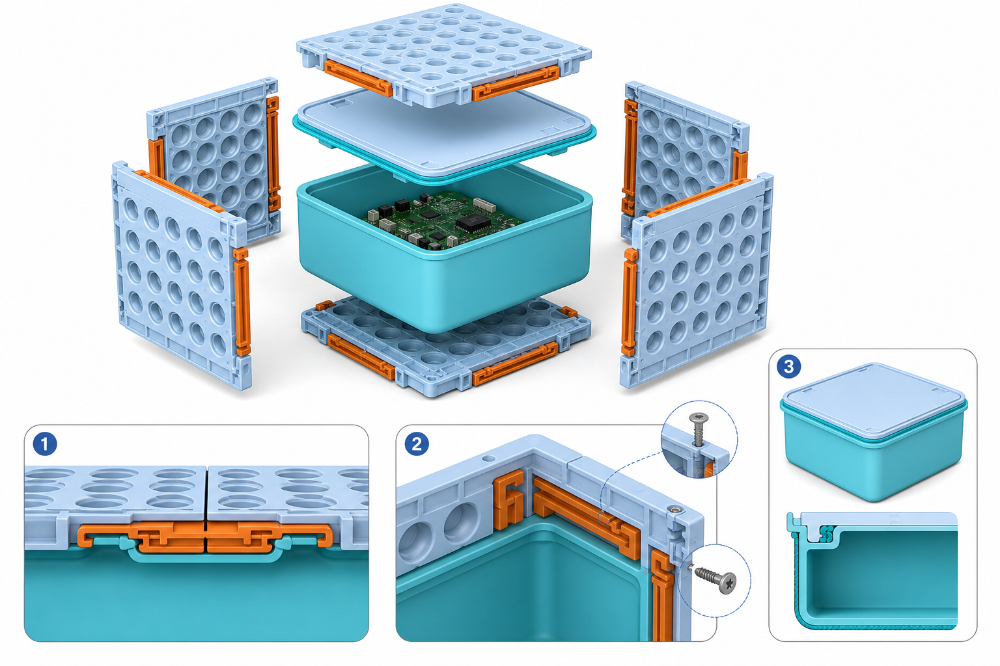
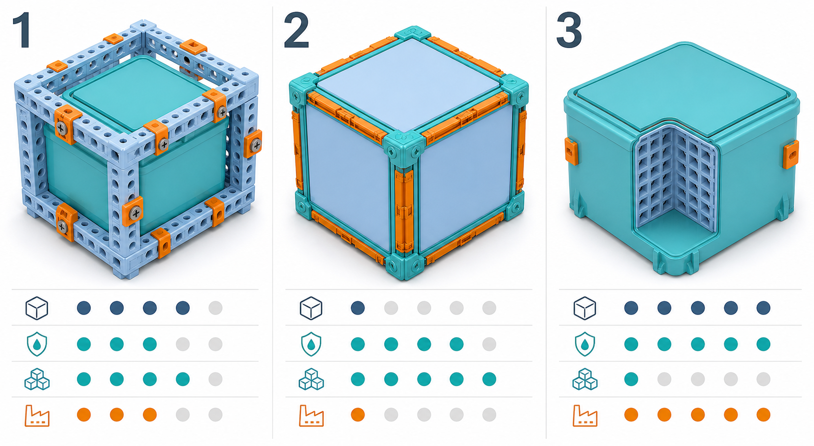

# Dirección de producto: montaje directo y resistencia al agua

## Problemas confirmados

1. La escuadra V3 coloca fijaciones horizontales y verticales sobre los mismos
   ejes; los pernos se intersectan y la solución no es fabricable.
2. Los pernos sueltos añaden piezas y herramientas cognitivas innecesarias.
3. Una placa perforada no puede ser por sí misma una barrera continua contra
   el agua.

## Decisión recomendada

Separar estructura y sellado:

- Las placas forman una estructura modular exterior.
- Los conectores plano y 90° se enganchan directamente a los bordes mediante
  clips o rieles con `click`; no usan pernos sueltos.
- Tornillos cortos y opcionales bloquean cada conector sin atravesar la zona
  sellada. En la escuadra, sus posiciones se alternan longitudinalmente para
  que los ejes perpendiculares nunca se crucen.
- Un recipiente interior continuo, con tapa y junta reemplazable, proporciona
  la resistencia al agua. Las uniones estructurales no tienen que sellar.

Esto crea tres modos sobre el mismo producto:

- **Juego:** clips, sin herramientas.
- **Bloqueado:** clips más tornillos opcionales.
- **Protegido:** recipiente interior y tapa con junta.

## Opciones y tradeoffs

En la imagen, las filas de puntos representan, de arriba abajo: simplicidad,
resistencia al agua, modularidad geométrica y facilidad de fabricación.

| Opción | Arquitectura | Ventaja principal | Coste principal | Decisión |
|---|---|---|---|---|
| 1 | Estructura modular + recipiente sellado | Buen equilibrio y sello independiente de las placas | Una pieza interior adicional | **Construir primero** |
| 2 | Seis paneles sellados con juntas, rieles y esquineros | El propio cubo modular es la envolvente | 12 juntas, 8 encuentros críticos y muchas tolerancias | Posponer |
| 3 | Caja monolítica con tapa y grid interior | Mejor sello, menos piezas y fabricación más simple | Casi no permite cambiar la forma exterior | Variante profesional |

## Criterios del próximo prototipo

- Dos placas se unen planas o a 90° con las manos y sin piezas sueltas.
- Ningún clip, tornillo o recorrido de herramienta se intersecta.
- Los tornillos son opcionales para estructura y quedan fuera del recipiente.
- El recipiente no tiene agujeros pasantes salvo puertos sellados dedicados.
- La tapa usa una junta continua y reemplazable con compresión controlada.
- No se anuncia `waterproof` ni un grado IP antes de ensayos físicos.

Los cables necesitan un puerto específico con prensaestopa o conector sellado;
pasar un cable por una ranura anularía el concepto de protección.
